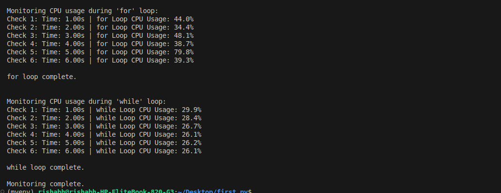
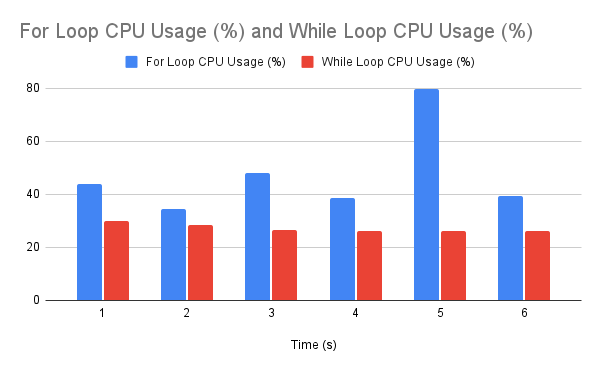

# **CPU Performance Comparison of Various Loops in Python: Analysis and Best Use Cases**


## _Document created by- Rishabh Joshi_


## **Table of Contents**  
<!-- TOC -->
1. [Objective](#objective)

2. [Understanding Loops](#understanding-loops)
   - [While Loop](#while-loop)
   - [For Loop](#for-loop)

3. [Uses of Loops](#uses-of-loops)

4. [CPU Comparison](#cpu-comparison)
   - [Time Module](#time-module)
   - [Psutil Module](#psutil-module)
   - [CProfile Module](#cprofile-module)
   - [Concluding CPU Comparison](#Concluding-CPU-Comparision-)

5. [Best Use Cases](#best-use-cases)

6. [Conclusion](#Conclusion-)

7. [References](#References-)
<!-- /TOC -->

## **Objective**

This document compares the performance of for loops and while loops in Python. We will look at how long each type of loop takes to execute and how much computer resources they use. By doing this, we aim to find out which loop is more efficient and when it is best to use each type.

## **Understanding Loops**
 
Loops are used to repeatedly execute a block of code as long as a certain condition is met. This is useful for tasks that require repeating actions, such as iterating over a list, performing calculations multiple times, or automating repetitive processes.Loops provide a way to automate repetitive tasks, making code cleaner and more efficient.

There are basically two different Loops in Python. 

**1- While Loop**

**2- For Loop**

## While Loop 


A while loop is a way to repeat actions in your program until given condition turns true. It keeps running a block of code as long as a certain condition remains true. Once that condition becomes false, the loop stops.

**Example code -**
```python
secret_number = 99
guess = 0

while guess != secret_number:
    guess = int(input("Guess the secret number (1-100): "))
    if guess == secret_number:
        print("Congrats! You guessed it right!")
    elif guess > 100 or guess < 1:
        print("Invalid input: Please enter a number between 1 and 100.")
    else:
        print("Try again!")

print("Game over.")
```
#### Output -


## For Loop 

In Python, a for loop is used to repeat a block of code a certain number of times or to go through items in a collection (like a list, string, or range of numbers). It's great for when you know exactly how many times you want to loop.

**Example code -**
```python

squares = [x**2 for x in range(11)]

print(squares)

```
#### Output


## Uses of Loops 

* Repeating Actions: Run the same code multiple times.


* Counting Numbers: Generate sequences of numbers.


* Condition-Based Repetition: Continue running until a condition changes.


  
## **CPU Comparison** 
CPU comparison means looking at how well the CPU (the brain of the computer) handles different pieces of code. This helps us see which parts of the code run faster or slower and which parts make the CPU work harder. By comparing, we can improve the code to make it run more efficiently

## **CPU Comparison: For Loop VS While Loop**

### time module

* **Firstly we are comparing For and While loop as per the time taken by both of them while execution. We have used **"Time"** Module for checking that how much time did For loop takes to be executed and same for while loop.**

**Example code-** 
```python
import time

# For Loop
start_time = time.time()
for i in range(100000000):
    pass
for_loop_time = time.time() - start_time

# While Loop
start_time = time.time()
i = 0
while i < 100000000:
    i += 1
    pass
while_loop_time = time.time() - start_time

print(f"For loop time: {for_loop_time}")
print(f"While loop time: {while_loop_time}")
```
#### Output-


### psutil module 

* **Now, showing CPU usage of For and While Loop by using **"psutil" (process and system utilities)** module, which fetch cpu usage details from APIs which are being use by any operating system . e.g.- (cat /proc/stat)- we can use this command for checking CPU usage. psutill module fetch data from /proc/stat and give usage details for execution of loops and here we will show CPU usage percentage during running Loop.**

**Example code**
```python
import psutil
import time

iterations = 100000000  
check_points = 6  # Number of CPU checks during the loop
interval = 1  # Interval of 1 second 

def monitor_cpu_usage(loop_type, iterations, check_points, interval):
    print(f"\nMonitoring CPU usage during '{loop_type}' loop:")
    
    cpu_usages = []
    start_time = time.time()
    next_check_time = start_time + interval

    if loop_type == 'for':
        for i in range(iterations):
         
            if len(cpu_usages) < check_points and time.time() >= next_check_time:
                cpu_usage = psutil.cpu_percent(interval=None)
                elapsed_time = time.time() - start_time
                print(f"Check {len(cpu_usages) + 1}: Time: {elapsed_time:.2f}s | {loop_type} Loop CPU Usage: {cpu_usage}%")
                cpu_usages.append(cpu_usage)
                next_check_time += interval 
        
    elif loop_type == 'while':
        i = 0
        while i < iterations:
           
            if len(cpu_usages) < check_points and time.time() >= next_check_time:
                cpu_usage = psutil.cpu_percent(interval=None)
                elapsed_time = time.time() - start_time
                print(f"Check {len(cpu_usages) + 1}: Time: {elapsed_time:.2f}s | {loop_type} Loop CPU Usage: {cpu_usage}%")
                cpu_usages.append(cpu_usage)
                next_check_time += interval 
            i += 1

    print(f"\n{loop_type} loop complete.\n")

monitor_cpu_usage('for', iterations, check_points, interval)


monitor_cpu_usage('while', iterations, check_points, interval)

print("Monitoring complete.")

```


#### Output-


## Graph of CPU percentage usage -:

- Avg of For Loop CPU usage =(44.0+34.4+48.1+38.7+79.8+39.3)/6= **47.38%**
- Avg of While Loop CPU usage =(29.9+28.4+26.7+26.1+26.2+26.1)/6= **27.23%**

 


### cprofile module

* **Now, we will use **"cprofile"** module to see the CPU comparison between for and while loops. cprofile module helps to give various aspects as :**
    
    ncalls: Number of times a function was called ,
    
    tottime: Time spent exclusively in this function, excluding calls to other functions.
    
    cumtime: Time spent in this function, including calls to sub-functions.
    
    percall: Time per function call (tottime / ncalls or cumtime / ncalls).

Let us see it with an example to compare for and while loop:


```python
import cProfile


iterations = 10000000

# Function with a for loop
def run_for_loop():
    for i in range(iterations):
        pass  

# Function with a while loop
def run_while_loop():
    i = 0
    while i < iterations:
        i += 1 


print("Profiling the for loop:")
cProfile.run('run_for_loop()')


print("\nProfiling the while loop:")
cProfile.run('run_while_loop()')
```
#### Output-


## Concluding CPU Comparsion-


| Aspect                   | For Loop               | While Loop              |
|--------------------------|------------------------|-------------------------|
| **Execution Time**       | 7.90 seconds              | 14.97 seconds               |
| **CPU Usage**            |38 %                     | 32%         |
| **Profiling - ncalls**   | 4 calls                | 4 calls                 |
| **Profiling - tottime**  | 0.32 seconds              | 0.70 seconds               |
| **Profiling - cumtime**   | 0.319 seconds              | 0.704 seconds               |
| **Profiling - percall**   | 0.319 seconds              | 0.704 seconds               |


- **Speed:**
The for loop is much faster (7.90 seconds) than the while loop (14.97 seconds).

- **CPU Usage:**
The for loop uses more CPU (38%) compared to the while loop (32%), but it completes the task quicker.

- **Efficiency:**
The for loop has lower total execution time (0.32 seconds) and time per call (0.319 seconds) compared to the while loop (0.70 seconds total, 0.704 seconds per call).

**For loops** are generally preferred for their efficiency and readability.**While loops** may require more resources in certain cases.


## **Best use cases**
#### **When we use while loops?**

* **Unknown Number of Iterations:** Use when you don't know in advance how many times the loop will run. It continues until a condition is met.

**Example:** Keep asking for user input until the correct password is entered.
```python
correct_password = "helloworld"

while True:
    
    password = input("Enter the password: ")
    
   
    if password == correct_password:
        print("Welcome")
        break
    else:
        print("Invalid password, try again")
```
#### Output-


* **Condition-Based Repetition:** Use when you want to run the loop based on a condition that could change during the loop’s execution.

**Example**: Monitor a temperature sensor and stop the loop once a critical temperature is reached.
```python
import random
import time


temperature = random.randint(60, 80) 
critical_temperature = 85


while temperature < critical_temperature:
    print(f"Current temperature: {temperature}°F")
    
    time.sleep(2)  
    
    temperature = random.randint(60, 90)
print("Warning: Critical temperature reached!")
```
#### Output-


### **When to Use for Loop:**

* **Fixed Number of Iterations:** Use when you know exactly how many times you need to loop, such as iterating over a fixed range of numbers or items in a list.

**Example:** Printing numbers from 1 to 10.
```python
for i in range(1, 11):
    print(i)
```
#### Output-


* **Iterating Over Collections:** Use when you want to iterate over elements in a list, tuple, set, or dictionary.

**Example:** Printing each item in a list of fruits.
```python
fruits = ['apple', 'banana', 'strawberry', 'watermelon', 'mango', 'cherry']
for fruit in fruits:
    print(fruit)
```
#### Output-


### **Summary:**

**Use a while loop when the number of iterations is uncertain, and the loop depends on a condition that can change during execution.**

**Use a for loop when you know the number of iterations in advance or are working with collections (like lists or ranges).**

## Conclusion-

This analysis of for loops and while loops in Python reveals that:

* Performance: For loops are generally faster, executing in about 7.90 seconds, while while loops take around 14.97 seconds. This makes for loops more efficient for tasks with a known number of iterations.

* CPU Usage: For loops also use CPU resources more effectively, consuming approximately 38%, compared to the while loop's 32% , so For loop is more efficient in this scenario also.
  
* Best Use Cases: Use for loops when the number of iterations is fixed, such as iterating through a list. Choose while loops for scenarios where the number of iterations can change, like waiting for user input.

In summary, for loops are preferred for their speed and efficiency, while while loops offer flexibility. Choosing the right loop type can significantly improve the performance of your Python code.


## References-

1. **Python Official Documentation on Loops**:
   - [Python for Loops](https://docs.python.org/3/tutorial/controlflow.html#defining-functions)
   - [Python while Loops](https://docs.python.org/3/tutorial/controlflow.html#while-statements)

2. **Understanding Performance with cProfile**:
   - [cProfile Documentation](https://docs.python.org/3/library/profile.html#module-cProfile)

3. **Measuring CPU Usage with psutil**:
   - [psutil Documentation](https://psutil.readthedocs.io/en/latest/)

4. **Performance Comparison Articles**:
   - [Python Loop Performance Comparison](https://realpython.com/python-for-loop/)
   - [Understanding Time Complexity in Python](https://www.geeksforgeeks.org/analysis-of-algorithms-set-1-asymptotic-analysis/)

